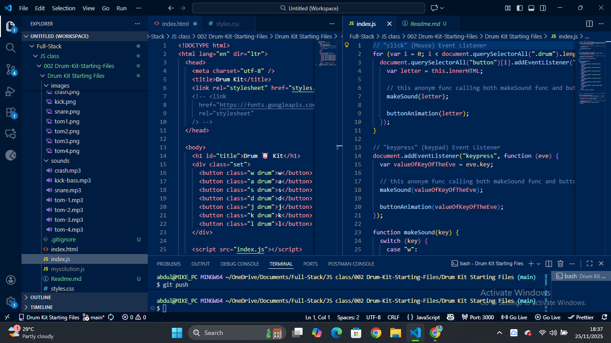
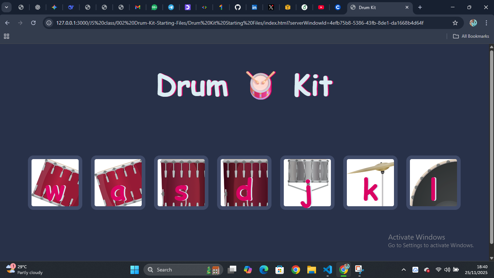

# 🥁 Drum Kit — Interactive JavaScript Project

An interactive Drum Kit built using HTML, CSS, and JavaScript.

Press keys or click the drum buttons to play sounds — a fun way to practice DOM events, audio triggering, and simple UI animations.

## 🚀 Features

⌨️ Keyboard Controls – Press mapped keys to play drum sounds

🖱️ Click-to-Play Buttons – All drums respond to click events

🔊 Realistic Drum Audio

✨ Button Animation on every hit

🧩 Beginner-friendly file structure

## 🛠️ Tech Used

### Frontend

- **HTML5** for markup
- **CSS3** for styling and layout
- **Google Fonts** for typography

### JavaScript

- **Event Listeners** (`click`, `keypress`)
- **DOM Selection** using `querySelectorAll()`
- **Audio() constructor** to load sound files
- **Functions & Control Flow** for mapping keys → sounds

### Tools

- **Visual Studio Code**
- **Live Server** for local preview
- **Git & GitHub** for version control

## 🧠 What I Learned

Handling DOM events like click and keypress

Using new Audio() to play sound files

Switch statements for routing key actions

Triggering animations with class toggling

Structuring small JavaScript projects cleanly

## 📸 Screenshots

### VS Code / Codespace

### Drum Kit UI (Browser Preview)

## 📜 License

MIT License
